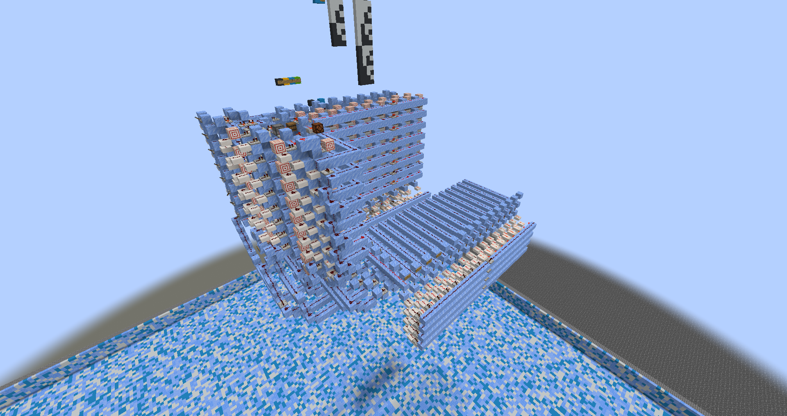
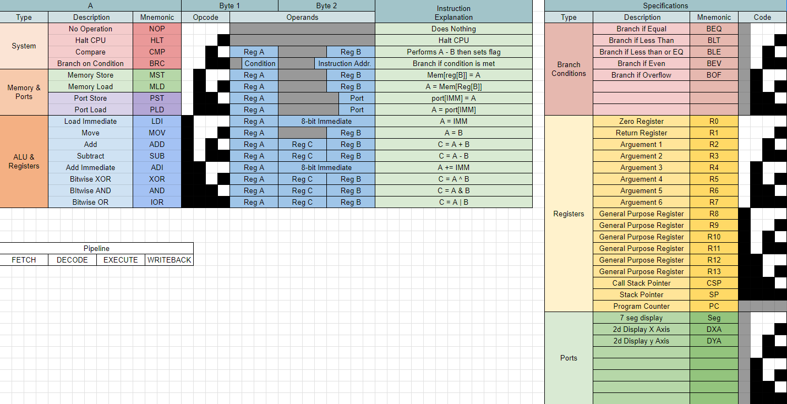

# LPU1.0

# Table of Contents
* [About](#about)
* [The Processor](#the-processor)
* [Instruction Set](#instruction-set)
* [To do](#to-do)

## About

LPU (Lysus Processing Unit) is an 8 bit Havard architecture CPU built inside of Minecraft using redstone mechanics to simulate binary logic. This will be a 4 stage pipelined CPU with a 2 byte [instruction set architecture](https://docs.google.com/spreadsheets/d/1FjiQlwFlFFbpPNQc1175PTzBfl2Y6gQHL5OqTxm_v3Y/edit?usp=sharing).

In this project there will also be an external assembler that will take assembly code written using this instruction set to the LPU machine code as well as a compiler for a custom c styled language called Craft-C (tentative name) that will transpile to that assembly language then be assembled into the machine code to be used by the CPU.

As of now, the primary focus will be spent on finishing the CPU then finishig the assembler. Craft-C will be worked on once those 2 parts of this project are completed

## The Processor



The processor is currently under construction. If you would like to see the processor for yourself then join the Open Redstone Egineers minecraft server at the following IP: mc.openredstone.org then us the `/plot tp lysus` command to get to the plot!

So far the ALU, Registers, Instruction decoders, flag registers, and branch decoders are in place

Reference the [To do](#to-do) for a full list of what still needs to be completed

Current Specs
- 8 bit ALU
- 16 byte Register File

## Instruction Set

<a href="https://docs.google.com/spreadsheets/d/1FjiQlwFlFFbpPNQc1175PTzBfl2Y6gQHL5OqTxm_v3Y/edit?usp=sharing" target="_blank"></a>

## How To Use

<h3>Assembler</h3>
To build the assembler first go into the `assembler` directory then use the `make` command to build the project (NOTE: Only the Lexer is done as of now)

```
make
```

## To do

- CPU
    - [ ] Finish branching by connecting the branch flag registers to the branch decoders
    - [ ] Make the Program Counter
    - [ ] Implement pipelining (Possibly not implementing pipelining in this CPU)
        - [ ] Account for RAW hazards
        - [ ] Implement forwarding and stalling
    - [ ] Created PROM
    - [ ] Make basic I/O
        - [ ] Output to 2D display
        - [ ] Output to 7 seg display using binary coded decimal
    - [ ] Create RAM
    - [ ] BUS EVERYTHING TOGETHER

- Assembler
    - [ ] Finish Parser (syntatical analysis)
    - [ ] Study and work on optimization techniques
    - [ ] Keep on learning about compilers and assemblers

- Craft-C
    - [ ] Yeah not gonna deal with this until the other stuff are done tbh lol

Copyright &copy; 2024 Austin Choi
